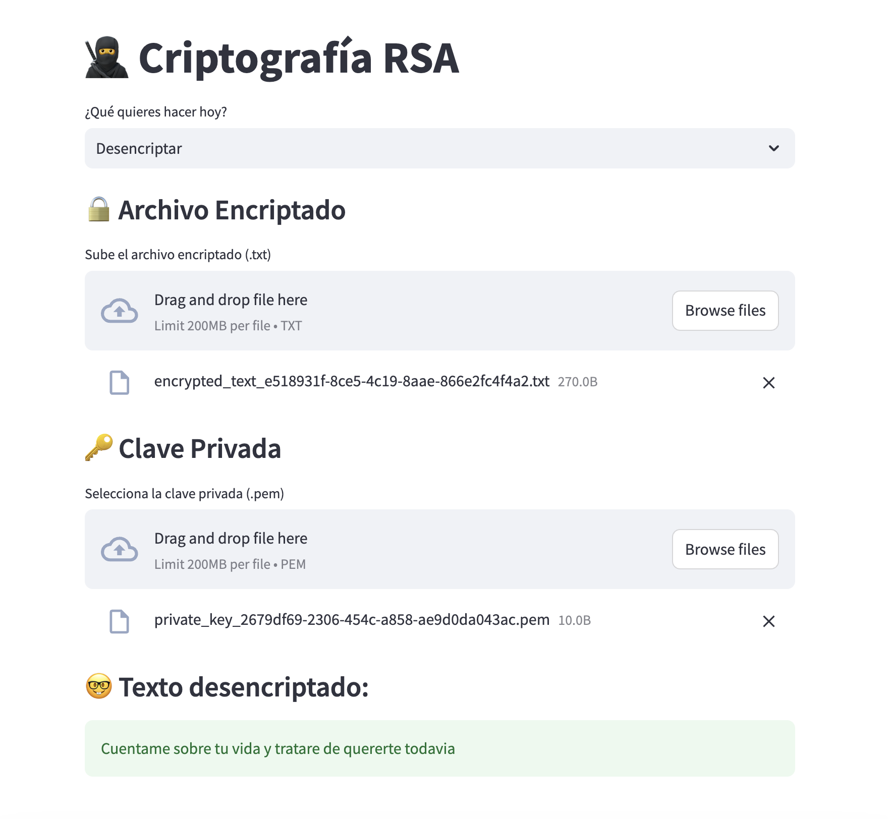

# Proyecto Matemática Computacional: Criptografía RSA

Este proyecto busca replicar el proceso de Criptografía RSA para encriptar y desencriptar archivos `.txt`

El enunciado del proyecto es el siguiente:
```
Encripte el contenido de un archivo de bloc de notas y envíelo a un compañero, adjuntando la clave privada, para que pueda desencriptarlo. 
El programa por implementar debe encriptar y desencriptar.
```

## 🤓 Teoría: Proceso de Criptografía RSA 
1. Elegir dos números primos distintos `(p, q)`
2. Calcular `n = p x q`
3. Sea la funcion Euler `φ(n) = (p-1)(q-1)`
4. Hallar `d` tal que `0 < d < φ(n)`, y `MCD [d, φ(n)] = 1` **(esto para la desencriptacion, llave privada)**
5. Calcular `e` tal que `e.d ≅ 1 mod (φ(n))` **(esto es para la encriptacion, llave publica)**
6. Para encriptar el mensaje: `C = M^e mod n`
7. Para desencriptar el mensaje: `M = C^d mod n`


## 🧑‍💻 Explicación del Código
### Generar números primos `(p, q)`
```py
def generate_primes(bits=8):
    p = q = 0
    while p == q:
        p = random.getrandbits(bits)
        q = random.getrandbits(bits)

        while not isprime(p): 
            p = random.getrandbits(bits)
        while not isprime(q): 
            q = random.getrandbits(bits)

    return p, q
```
1. Generar dos números primos aleatorios `p` y `q` de `bits (8)` bits
2. Mientras que sean iguales, generar nuevos números
3. Mientras que no sean primos, generar nuevos números
4. Devolver los números primos generados

#### Porque 8 bits?
En aplicaciones criptográficas (como RSA), el tamaño de los números primos determina la seguridad del sistema. Cuantos más bits, más grandes son los números y más difícil es factorizarlos.

Con 8 bits, los números estarán en el rango de 0 a 255 (2^8-1). Ni tan fácil, ni tan difícil.


### Generar llaves publica y privada
```py
def rsa_keygen(bits=8):
    # Paso 1: Generar dos números primos
    p, q = generate_primes(bits)
    print(f"Primos generados: p={p}, q={q}")

    # Paso 2: Calcular n = p * q
    n = p * q

    # Paso 3: Calcular la función de Euler φ(n) = (p-1)(q-1)
    phi_n = (p - 1) * (q - 1)

    # Paso 4: Elegir d tal que MCD[d, φ(n)] = 1
    d = random.randint(2, phi_n - 1)
    while math.gcd(d, phi_n) != 1:
        d = random.randint(2, phi_n - 1)

    # Paso 5: Calcular e tal que e * d ≅ 1 mod (φ(n))
    e = mod_inverse(d, phi_n)

    # Clave pública: (e, n), Clave privada: (d, n)
    return (e, n), (d, n)
```
1. Generar llaves publica y privada
2. Calcular  n = p * q
3. Calcular la función de Euler `φ(n) = (p-1)(q-1)`
4. Elegir aleatoriamente `d` mientras que `math.gcd`, `MCD[d, φ(n)] != 1`, volver a generar `d`
5. Calcular `e` tal que `e * d ≅ 1 mod (φ(n))`, la funcion `mod_inverse` es la que hace esto
6. Devolver las llaves publica y privada


### Encriptar mensaje
```py
def encrypt(message, public_key):
    e, n = public_key
    encrypted = [pow(ord(char), e, n) for char in message]
    return encrypted
```
1. Pasar la llave publica junto con n
2. Encriptar el mensaje
    - `for char in message`: Itera sobre el mensaje original
    - `ord(char)`: Obtiene el valor ASCII del carácter. e.g 'A' se convierte en 65, 'a' en 97, etc.
    - `pow(ord(char), e, n)`: Calcula `C = M^e mod n` para cada carácter
        - Toma el valor numérico del carácter `(ord(char))`
        - Lo eleva a la potencia `e` (el exponente de la clave pública)
        - Calcula el módulo `n` del resultado
3. Devolver el mensaje encriptado
    
    
### Desencriptar mensaje
```py
def decrypt(ciphertext, private_key):
    d, n = private_key
    decrypted = ''.join([chr(pow(char, d, n)) for char in ciphertext])
    return decrypted
```
1. Pasar la llave privada junto con n
2. Desencriptar el mensaje
    - `for char in ciphertext`: Itera sobre el mensaje encriptado, el char ya es un entero por lo que no es necesario usar `ord(char)`.
    - `chr(pow(char, d, n))`: Desencripta el mensaje
        - `pow(char, d, n)`: Calcula `M = C^d mod n` para cada carácter
        - `chr()`: Obtiene el carácter correspondiente al valor numérico
    - `''.join()`: Une los caracteres en un solo string, (por si el mensaje es más de una línea)
3. Devolver el mensaje desencriptado


## 🛠️ Implementación
1. Instalar requerimientos
    ```bash
    pip install -r requirements.txt
    ```

2. Ejecutar la aplicación
    ```bash
    streamlit run app.py
    ```

3. Cargar un archivo `.txt` para encriptar

4. Descargar el archivo encriptado y la llave privada

5. Cargar el archivo encriptado y la llave privada para desencriptar

6. El texto desencriptado se muestra en la pantalla


## 📊 Resultados
